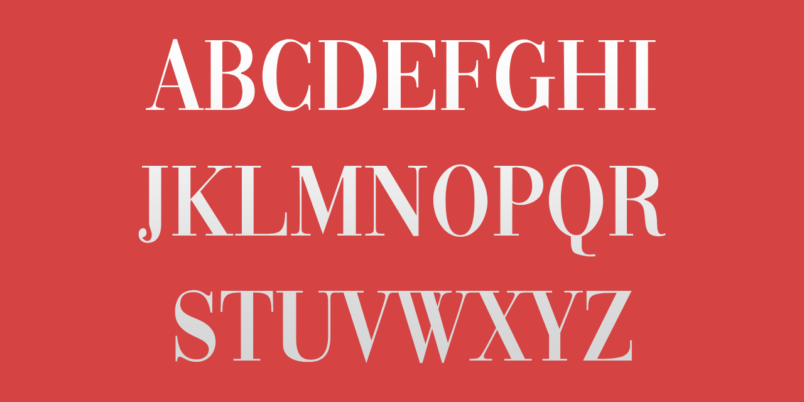

# Notdef
Notdef glyph is a special character that indicates that the current font does not contain a visual representation (glyph) for the character that should have been displayed. In other words, the Unicode code point has no associated graphical representation.

## Variable Font Axe

Notdef has the following axe:

  Tag | Default | Static Instances
--- | --- | ---
  wght | 400 | Regular

## License
This Font Software is licensed under the SIL Open Font License, Version 1.1.
This license is available with a FAQ at [https://openfontlicense.org](https://openfontlicense.org)

